# Tài liệu Mô tả Luồng Màn hình (SCREENFLOW.md)

Tài liệu này đặc tả luồng chuyển cảnh (Screen Flow) và trải nghiệm người dùng (UX Flow) của ứng dụng **FINORA**. Nó ánh xạ trực tiếp từ sơ đồ kiến trúc hệ thống màn hình và luồng nghiệp vụ.

---

## 1. Sơ đồ Tổng quan Luồng Màn hình (Mermaid Diagram)

```mermaid
graph TD
    %% Định nghĩa các node
    Splash[Splash Screen]
    Onboarding[Onboarding - 3 slides]
    Login[Login Screen]
    AuthChoice[Authentication Choice]
    LoginEmail[Login with Email]
    LoginGoogle[Login with Google]
    Register[Register Screen]
    ForgotPassword[Forgot Password]
    ResetPassword[Reset Password]
    
    PinVerify[PIN Code Verification<br/>If enabled]
    WrongPin[Wrong PIN<br/>5 times]
    ReLogin[Re-login Required<br/>Email / Google]
    
    Home[Home Dashboard]
    
    %% Luồng Thêm nhanh giao dịch
    QuickAdd[Quick Add Transaction<br/>Bottom Sheet / FAB]
    AddTransaction[Add Transaction]
    ManualInput[Manual Input]
    VoiceInput[Voice Input]
    AutoParse[Auto Parse & Suggest<br/>Category, Amount]
    ConfirmTx[Confirm Transaction]
    SaveTx[Save Transaction]
    
    %% Luồng Danh sách giao dịch
    TxList[Transactions List<br/>Search / Filter]
    FilterSort[Filter / Sort Bottom Sheet]
    TxDetail[Transaction Detail]
    EditTx[Edit Transaction]
    DeleteTx[Delete Transaction]
    
    %% Luồng Phân tích & Báo cáo
    Analytics[Analytics Dashboard]
    CategoryPie[Category Pie Chart]
    MonthlyBar[Monthly Bar Chart]
    IncExp[Income vs Expense]
    TopSpending[Top Spending Category]
    ReportDetail[Monthly Report Detail]
    CompareMonth[Compare Previous Month]
    ReportSummary[Report Summary]
    
    %% Luồng Ngân sách
    Budget[Budget Screen]
    BudgetDetail[Budget Detail]
    BudgetProgress[Budget Progress]
    BudgetWarning[Budget Exceeded<br/>Warning]
    
    %% Luồng Mục tiêu tiết kiệm
    Savings[Savings Goals]
    GoalDetail[Goal Detail]
    AddContribution[Add Contribution]
    GoalHistory[Goal History]
    AddNewGoal[Add New Goal]
    
    %% Luồng Tài khoản cá nhân
    Profile[Profile]
    WalletMgmt[Wallet Management]
    WalletList[Wallet List]
    AddEditWallet[Add / Edit Wallet]
    DeleteWallet[Delete Wallet]
    Settings[Settings]
    DarkMode[Dark Mode]
    NotifySettings[Notification Settings]
    Logout[Logout]
    ExportPDF[Export Report - PDF]
    
    %% Ngoại tuyến & Đồng bộ
    OfflineMode[Offline Mode<br/>Local Storage]
    SyncStatus[Sync Status]
    SyncNow[Sync Now]
    LastSync[Last Sync Info]
    Syncing[Syncing...]
    SyncCompleted[Sync Completed]

    %% Kết nối luồng khởi động và xác thực
    Splash --> Onboarding
    Onboarding --> Login
    Login --> AuthChoice
    AuthChoice --> LoginEmail
    AuthChoice --> LoginGoogle
    
    LoginEmail --> Register
    LoginEmail --> ForgotPassword
    ForgotPassword --> ResetPassword
    
    LoginEmail --> PinVerify
    LoginGoogle --> PinVerify
    
    PinVerify -.->|Wrong PIN 5 times| WrongPin
    WrongPin --> ReLogin
    ReLogin --> Login
    
    PinVerify -->|Success / Disabled| Home
    
    %% Kết nối Home Dashboard tới các chức năng chính
    Home --> QuickAdd
    Home --> TxList
    Home --> Analytics
    Home --> Budget
    Home --> Savings
    Home --> Profile
    
    %% Kết nối Luồng Thêm nhanh giao dịch
    QuickAdd --> AddTransaction
    AddTransaction --> ManualInput
    AddTransaction --> VoiceInput
    VoiceInput --> AutoParse
    AutoParse --> ConfirmTx
    ConfirmTx --> SaveTx
    SaveTx --> Home
    ManualInput --> SaveTx
    
    %% Kết nối Luồng Danh sách giao dịch
    TxList --> FilterSort
    TxList --> TxDetail
    TxDetail --> EditTx
    TxDetail --> DeleteTx
    
    %% Kết nối Luồng Phân tích & Báo cáo
    Analytics --> CategoryPie
    Analytics --> MonthlyBar
    Analytics --> IncExp
    Analytics --> TopSpending
    CategoryPie --> ReportDetail
    MonthlyBar --> ReportDetail
    IncExp --> ReportDetail
    TopSpending --> ReportDetail
    ReportDetail --> CompareMonth
    ReportDetail --> ReportSummary
    
    %% Kết nối Luồng Ngân sách
    Budget --> BudgetDetail
    BudgetDetail --> BudgetProgress
    BudgetProgress --> BudgetWarning
    
    %% Kết nối Luồng Mục tiêu tiết kiệm
    Savings --> GoalDetail
    GoalDetail --> AddContribution
    GoalDetail --> GoalHistory
    Savings --> AddNewGoal
    
    %% Kết nối Luồng Tài khoản cá nhân
    Profile --> WalletMgmt
    Profile --> Savings
    Profile --> Settings
    Profile --> ExportPDF
    
    WalletMgmt --> WalletList
    WalletList --> AddEditWallet
    WalletList --> DeleteWallet
    
    Settings --> DarkMode
    Settings --> NotifySettings
    Settings --> Logout
    
    %% Kết nối Luồng Offline & Sync
    SaveTx -.-> OfflineMode
    EditTx -.-> OfflineMode
    DeleteTx -.-> OfflineMode
    
    OfflineMode --> SyncStatus
    SyncStatus --> SyncNow
    SyncStatus --> LastSync
    SyncNow --> Syncing
    LastSync --> Syncing
    Syncing --> SyncCompleted
```

---

## 2. Chi tiết các Phân luồng & Trải nghiệm Người dùng

### 2.1 Luồng Đăng nhập & Xác thực (Authentication Flow)
1.  **Splash Screen**: Màn hình chào khi mở ứng dụng. Thực hiện kiểm tra trạng thái đăng nhập và kiểm tra xem mã PIN bảo mật có được kích hoạt hay không.
2.  **Onboarding (3 Slides)**: Giới thiệu các tính năng nổi bật của FINORA cho người dùng mới.
3.  **Login Screen & Auth Choice**: Cho phép người dùng lựa chọn:
    *   *Đăng nhập bằng Email*: Đi vào màn hình điền email & mật khẩu.
    *   *Đăng nhập bằng Google*: Liên kết tài khoản trực tiếp qua SDK Google.
    *   *Màn hình phụ trợ*: `Register Screen` (Đăng ký mới), `Forgot Password` (Yêu cầu đặt lại mật khẩu) -> `Reset Password` (Thiết lập lại mật khẩu qua email).
4.  **PIN Code Verification**: Nếu người dùng đã cài đặt mã khóa bảo vệ bằng mã PIN:
    *   Nhập mã PIN để vào ứng dụng.
    *   Nếu nhập sai quá **5 lần**, ứng dụng khóa tạm thời và yêu cầu **Re-login** lại từ đầu thông qua phương thức Email hoặc Google.

---

### 2.2 Trung tâm Điều khiển (Home Dashboard Hub)
Sau khi xác thực thành công, người dùng sẽ vào **Home Dashboard**. Đây là trung tâm phân phối điều hướng đi 6 nhánh nghiệp vụ lớn.

#### Nhánh 1: Thêm nhanh giao dịch (Quick Add Transaction)
*   Kích hoạt thông qua nút bấm nổi (**FAB - Floating Action Button**) hoặc **Bottom Sheet**.
*   **Manual Input**: Nhập liệu giao dịch thủ công bằng cách điền số tiền, chọn ví, chọn danh mục và viết ghi chú.
*   **Voice Input**: Nhập liệu bằng giọng nói (Push-To-Talk). Hệ thống kích hoạt dịch vụ ghi âm, nhận diện giọng nói:
    *   *Auto Parse & Suggest*: Tự động phân tích câu nói của người dùng để trích xuất số tiền và đề xuất danh mục tương ứng (ví dụ: "Ăn phở 50 nghìn" -> Số tiền: 50.000đ, Danh mục: Ăn uống).
    *   *Confirm & Save*: Người dùng xác nhận thông tin được trích xuất trước khi lưu giao dịch chính thức.

#### Nhánh 2: Danh sách giao dịch (Transactions List)
*   Hiển thị danh sách toàn bộ giao dịch đã ghi nhận.
*   Hỗ trợ tìm kiếm theo từ khóa và lọc nâng cao qua **Filter / Sort Bottom Sheet** (lọc theo ví, danh mục, khoảng thời gian, sắp xếp theo số tiền lớn/nhỏ...).
*   **Transaction Detail**: Xem chi tiết thông tin của một giao dịch. Từ đây có thể chuyển sang màn hình **Edit Transaction** (Sửa giao dịch) hoặc bấm **Delete Transaction** (Xóa giao dịch).

#### Nhánh 3: Thống kê & Phân tích (Analytics Dashboard)
*   Cung cấp các biểu đồ trực quan hóa dữ liệu tài chính của người dùng:
    *   *Category Pie Chart*: Tỷ lệ phần trăm chi tiêu của từng danh mục.
    *   *Monthly Bar Chart*: Biểu đồ cột thể hiện biến động chi tiêu theo thời gian.
    *   *Income vs Expense*: Biểu đồ so sánh chênh lệch giữa thu nhập và chi tiêu.
    *   *Top Spending Category*: Danh sách các danh mục tốn nhiều tiền nhất.
*   **Monthly Report Detail**: Báo cáo chi tiết theo tháng, hỗ trợ so sánh sự thay đổi chi tiêu với tháng trước (`Compare Previous Month`) và cung cấp một bản tóm tắt nhanh (`Report Summary`).

#### Nhánh 4: Quản lý Ngân sách (Budget Screen)
*   Quản lý hạn mức chi tiêu được đặt ra cho các danh mục cụ thể (ví dụ: Giới hạn ăn uống 3 triệu/tháng).
*   **Budget Detail**: Xem chi tiết mức sử dụng ngân sách hiện tại.
*   **Budget Progress**: Thanh tiến trình thể hiện lượng tiền đã dùng so với hạn mức.
*   **Budget Exceeded Warning**: Khi chi tiêu thực tế vượt hạn mức thiết lập, ứng dụng hiển thị cảnh báo đỏ trực quan trên UI để người dùng kịp thời điều chỉnh hành vi.

#### Nhánh 5: Mục tiêu Tiết kiệm (Savings Goals)
*   Giúp người dùng lên kế hoạch tiết kiệm tiền cho các mục tiêu tương lai.
*   **Goal Detail**: Hiển thị tổng số tiền cần tích lũy, số tiền hiện tại và thời hạn.
*   **Add Contribution**: Thêm một khoản tiền đóng góp mới vào mục tiêu để tăng tiến độ tích lũy.
*   **Goal History**: Nhật ký ghi nhận các đợt đóng góp tiền trước đó.
*   **Add New Goal**: Tạo mục tiêu tích lũy mới với tên, số tiền đích và hạn chót.

#### Nhánh 6: Trang cá nhân & Cấu hình (Profile)
*   **Wallet Management**: Xem danh sách các ví tài chính hoạt động (`Wallet List`). Hỗ trợ tạo mới/chỉnh sửa (`Add/Edit Wallet`) hoặc xóa ví (`Delete Wallet`).
*   **Savings Goals**: Truy cập nhanh vào quản lý mục tiêu tiết kiệm.
*   **Settings**:
    *   *Dark Mode*: Bật/tắt giao diện tối.
    *   *Notification Settings*: Bật/tắt nhận thông báo nhắc nhở chi tiêu hoặc cảnh báo ngân sách.
    *   *Logout*: Đăng xuất tài khoản khỏi thiết bị.
*   **Export Report (PDF)**: Cho phép xuất báo cáo tài chính định dạng PDF để tải về máy hoặc chia sẻ.

---

## 3. Cơ chế hoạt động Ngoại tuyến & Đồng bộ (Offline & Sync Logic)

Ứng dụng FINORA được thiết kế để hoạt động trơn tru ngay cả khi mất kết nối mạng:

1.  **Chế độ Ngoại tuyến (Offline Mode)**:
    *   Mọi thao tác chỉnh sửa dữ liệu (Thêm mới, Sửa, Xóa giao dịch) khi không có mạng sẽ được ghi nhận và lưu tạm thời vào bộ nhớ cục bộ thiết bị dưới dạng file JSON (Local Storage) thông qua `FileStorageService`.
2.  **Đồng bộ dữ liệu (Sync Status)**:
    *   Khi ứng dụng phát hiện có kết nối mạng trở lại, trạng thái đồng bộ sẽ được kích hoạt.
    *   Người dùng có thể chủ động bấm **Sync Now** để gửi gói tin cập nhật cục bộ lên server ASP.NET Core API.
    *   Ứng dụng hiển thị trạng thái chuyển đổi: `Syncing...` (Đang đồng bộ) -> `Sync Completed` (Đồng bộ hoàn tất) và cập nhật thông tin thời gian đồng bộ cuối cùng (`Last Sync Info`).
