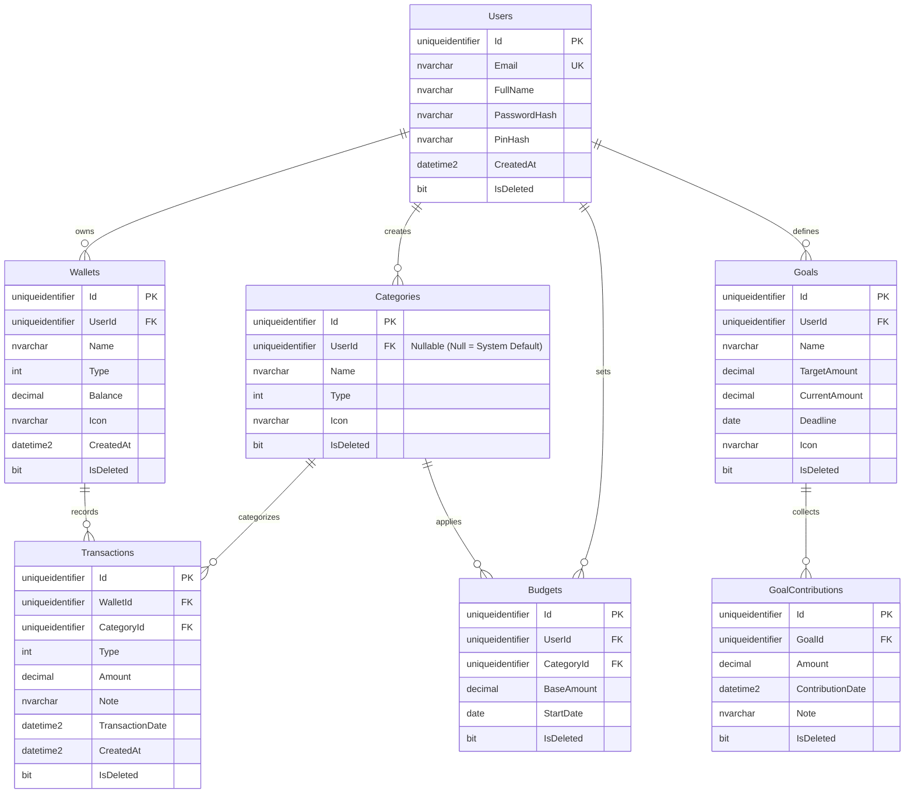

# Tài liệu Thiết kế Cơ sở Dữ liệu (DATABASE.md)

Tài liệu này mô tả chi tiết thiết kế cơ sở dữ liệu của ứng dụng quản lý chi tiêu **FINORA**. Hệ thống sử dụng **Microsoft SQL Server** làm hệ quản trị cơ sở dữ liệu.

---

## 1. Sơ đồ Quan hệ Thực thể (Entity Relationship Diagram - ERD)

Dưới đây là sơ đồ mối quan hệ giữa các bảng trong hệ thống:

---

## 2. Chi tiết các bảng dữ liệu

### 2.1 Bảng `Users` (Người dùng)
Bảng lưu trữ thông tin tài khoản và xác thực của người dùng.

| Tên Cột | Kiểu Dữ Liệu | Nullable | Khóa | Giá Trị Mặc Định | Mô Tả |
| :--- | :--- | :---: | :---: | :---: | :--- |
| `Id` | `UNIQUEIDENTIFIER` | Không | PK | `NEWID()` | Mã định danh duy nhất cho mỗi người dùng. |
| `Email` | `NVARCHAR(256)` | Không | UK | - | Địa chỉ email dùng để đăng nhập và nhận thông tin (Unique). |
| `FullName` | `NVARCHAR(100)` | Không | - | - | Họ và tên của người dùng. |
| `PasswordHash`| `NVARCHAR(MAX)` | Không | - | - | Mật khẩu tài khoản đã qua mã hóa bảo mật. |
| `PinHash` | `NVARCHAR(MAX)` | Có | - | `NULL` | Mã PIN bảo mật (dùng để đăng nhập nhanh hoặc xác thực trên app di động). |
| `CreatedAt` | `DATETIME2` | Có | - | `GETDATE()` | Ngày giờ tạo tài khoản. |
| `IsDeleted` | `BIT` | Có | - | `0` | Trạng thái xóa mềm (`0`: Hoạt động, `1`: Đã xóa). |

---

### 2.2 Bảng `Wallets` (Ví tài chính)
Bảng lưu trữ thông tin về các tài khoản hoặc ví tiền của người dùng.

| Tên Cột | Kiểu Dữ Liệu | Nullable | Khóa | Giá Trị Mặc Định | Mô Tả |
| :--- | :--- | :---: | :---: | :---: | :--- |
| `Id` | `UNIQUEIDENTIFIER` | Không | PK | `NEWID()` | Mã định danh duy nhất cho ví. |
| `UserId` | `UNIQUEIDENTIFIER` | Không | FK | - | Liên kết tới bảng `Users(Id)`. Người sở hữu ví. |
| `Name` | `NVARCHAR(100)` | Không | - | - | Tên ví (ví dụ: Tiền mặt, Techcombank, Momo...). |
| `Type` | `INT` | Không | - | - | Phân loại ví: `1`: Cash (Tiền mặt) `2`: Bank (Ngân hàng) `3`: EWallet (Ví điện tử) |
| `Balance` | `DECIMAL(18,2)` | Có | - | `0` | Số tiền dư hiện tại trong ví. |
| `Icon` | `NVARCHAR(50)` | Có | - | `NULL` | Tên/Đường dẫn icon đại diện hiển thị trên ứng dụng. |
| `CreatedAt` | `DATETIME2` | Có | - | `GETDATE()` | Ngày giờ tạo ví. |
| `IsDeleted` | `BIT` | Có | - | `0` | Trạng thái xóa mềm (`0`: Hoạt động, `1`: Đã xóa). |

---

### 2.3 Bảng `Categories` (Danh mục chi tiêu/thu nhập)
Phân loại các khoản chi tiêu hoặc thu nhập.

| Tên Cột | Kiểu Dữ Liệu | Nullable | Khóa | Giá Trị Mặc Định | Mô Tả |
| :--- | :--- | :---: | :---: | :---: | :--- |
| `Id` | `UNIQUEIDENTIFIER` | Không | PK | `NEWID()` | Mã định danh danh mục. |
| `UserId` | `UNIQUEIDENTIFIER` | Có | FK | `NULL` | Liên kết tới bảng `Users(Id)`. Nếu bằng `NULL` thì đây là danh mục mặc định của hệ thống (System Default). |
| `Name` | `NVARCHAR(100)` | Không | - | - | Tên danh mục (ví dụ: Ăn uống, Lương, Di chuyển...). |
| `Type` | `INT` | Không | - | - | Loại danh mục: `1`: Income (Thu nhập) `2`: Expense (Chi tiêu) |
| `Icon` | `NVARCHAR(50)` | Có | - | `NULL` | Tên/Đường dẫn icon đại diện cho danh mục. |
| `IsDeleted` | `BIT` | Có | - | `0` | Trạng thái xóa mềm (`0`: Hoạt động, `1`: Đã xóa). |

---

### 2.4 Bảng `Transactions` (Giao dịch tài chính)
Bảng ghi lại mọi hoạt động thu hoặc chi tiền từ các ví của người dùng.

| Tên Cột | Kiểu Dữ Liệu | Nullable | Khóa | Giá Trị Mặc Định | Mô Tả |
| :--- | :--- | :---: | :---: | :---: | :--- |
| `Id` | `UNIQUEIDENTIFIER` | Không | PK | `NEWID()` | Mã định danh giao dịch. |
| `WalletId` | `UNIQUEIDENTIFIER` | Không | FK | - | Liên kết tới bảng `Wallets(Id)`. Ví thực hiện giao dịch. |
| `CategoryId` | `UNIQUEIDENTIFIER` | Không | FK | - | Liên kết tới bảng `Categories(Id)`. Danh mục của giao dịch. |
| `Type` | `INT` | Không | - | - | Phân loại giao dịch: `1`: Income (Thu nhập) `2`: Expense (Chi tiêu) |
| `Amount` | `DECIMAL(18,2)` | Không | - | - | Số tiền giao dịch (Ràng buộc: `Amount > 0`). |
| `Note` | `NVARCHAR(500)` | Có | - | `NULL` | Ghi chú hoặc mô tả cho giao dịch. |
| `TransactionDate`| `DATETIME2` | Không | - | - | Ngày giờ thực tế phát sinh giao dịch. |
| `CreatedAt` | `DATETIME2` | Có | - | `GETDATE()` | Ngày giờ hệ thống ghi nhận bản ghi giao dịch này. |
| `IsDeleted` | `BIT` | Có | - | `0` | Trạng thái xóa mềm (`0`: Hoạt động, `1`: Đã xóa). |

---

### 2.5 Bảng `Budgets` (Ngân sách chi tiêu)
Thiết lập hạn mức chi tiêu cho một danh mục cụ thể trong tháng.

| Tên Cột | Kiểu Dữ Liệu | Nullable | Khóa | Giá Trị Mặc Định | Mô Tả |
| :--- | :--- | :---: | :---: | :---: | :--- |
| `Id` | `UNIQUEIDENTIFIER` | Không | PK | `NEWID()` | Mã định danh ngân sách. |
| `UserId` | `UNIQUEIDENTIFIER` | Không | FK | - | Liên kết tới bảng `Users(Id)`. Người thiết lập ngân sách. |
| `CategoryId` | `UNIQUEIDENTIFIER` | Không | FK | - | Liên kết tới bảng `Categories(Id)`. Danh mục áp dụng hạn mức ngân sách này. |
| `BaseAmount` | `DECIMAL(18,2)` | Không | - | - | Số tiền hạn mức tối đa cho phép (Ràng buộc: `BaseAmount > 0`). |
| `StartDate` | `DATE` | Không | - | - | Ngày bắt đầu áp dụng chu kỳ ngân sách (thường bắt đầu theo tháng). |
| `IsDeleted` | `BIT` | Có | - | `0` | Trạng thái xóa mềm (`0`: Hoạt động, `1`: Đã xóa). |

---

### 2.6 Bảng `Goals` (Mục tiêu tiết kiệm)
Quản lý các kế hoạch tiết kiệm tiền cho những mục tiêu lớn của người dùng.

| Tên Cột | Kiểu Dữ Liệu | Nullable | Khóa | Giá Trị Mặc Định | Mô Tả |
| :--- | :--- | :---: | :---: | :---: | :--- |
| `Id` | `UNIQUEIDENTIFIER` | Không | PK | `NEWID()` | Mã định danh mục tiêu. |
| `UserId` | `UNIQUEIDENTIFIER` | Không | FK | - | Liên kết tới bảng `Users(Id)`. Người thiết lập mục tiêu. |
| `Name` | `NVARCHAR(100)` | Không | - | - | Tên mục tiêu (ví dụ: Mua nhà, Mua xe, Đám cưới...). |
| `TargetAmount` | `DECIMAL(18,2)` | Không | - | - | Số tiền đích cần đạt được (Ràng buộc: `TargetAmount > 0`). |
| `CurrentAmount`| `DECIMAL(18,2)` | Có | - | `0` | Số tiền tích lũy hiện tại. |
| `Deadline` | `DATE` | Không | - | - | Ngày hạn chót cần hoàn thành mục tiêu. |
| `Icon` | `NVARCHAR(50)` | Có | - | `NULL` | Biểu tượng đại diện của mục tiêu. |
| `IsDeleted` | `BIT` | Có | - | `0` | Trạng thái xóa mềm (`0`: Hoạt động, `1`: Đã xóa). |

---

### 2.7 Bảng `GoalContributions` (Lịch sử đóng góp mục tiêu)
Ghi nhận các khoản tiền trích ra để tích lũy cho từng mục tiêu cụ thể.

| Tên Cột | Kiểu Dữ Liệu | Nullable | Khóa | Giá Trị Mặc Định | Mô Tả |
| :--- | :--- | :---: | :---: | :---: | :--- |
| `Id` | `UNIQUEIDENTIFIER` | Không | PK | `NEWID()` | Mã định danh khoản đóng góp. |
| `GoalId` | `UNIQUEIDENTIFIER` | Không | FK | - | Liên kết tới bảng `Goals(Id)`. Mục tiêu nhận tiền đóng góp. |
| `Amount` | `DECIMAL(18,2)` | Không | - | - | Số tiền đóng góp trong đợt này (Ràng buộc: `Amount > 0`). |
| `ContributionDate`| `DATETIME2`| Không | - | - | Ngày giờ thực hiện đóng góp. |
| `Note` | `NVARCHAR(500)` | Có | - | `NULL` | Ghi chú thêm về khoản đóng góp. |
| `IsDeleted` | `BIT` | Có | - | `0` | Trạng thái xóa mềm (`0`: Hoạt động, `1`: Đã xóa). |

---

## 3. Chỉ mục tối ưu hóa truy vấn (Indexes)

Hệ thống được thiết kế các Non-Clustered Indexes sau nhằm gia tăng tốc độ truy vấn ở các màn hình báo cáo, thống kê và danh sách:

1.  **`IX_Transactions_WalletId`** (trên bảng `Transactions`): Tối ưu hóa việc lọc và hiển thị lịch sử giao dịch của một Ví cụ thể.
2.  **`IX_Transactions_CategoryId`** (trên bảng `Transactions`): Hỗ trợ thống kê chi tiêu theo từng Danh mục nhanh chóng.
3.  **`IX_Transactions_TransactionDate`** (trên bảng `Transactions`): Tối ưu hóa việc lọc danh sách giao dịch theo khoảng thời gian (theo tuần, tháng, năm).
4.  **`IX_Budgets_UserId_CategoryId`** (trên bảng `Budgets`): Tối ưu truy vấn kiểm tra ngân sách người dùng cho một danh mục cụ thể khi họ nhập giao dịch mới.
5.  **`IX_Goals_UserId`** (trên bảng `Goals`): Tối ưu việc load danh sách các mục tiêu tiết kiệm thuộc về một người dùng cụ thể.

---

## 4. Các Quy tắc Nghiệp vụ Dữ liệu (Business Rules)
*   **Xóa Mềm (Soft Delete)**: Tất cả các bảng đều có cột `IsDeleted`. Khi người dùng thực hiện xóa ví, danh mục, giao dịch, mục tiêu... hệ thống chỉ cập nhật `IsDeleted = 1` chứ không xóa vật lý khỏi Database. Các câu lệnh query lấy dữ liệu lên ứng dụng luôn phải kèm điều kiện `WHERE IsDeleted = 0`.
*   **Ràng buộc số tiền dương**: Các cột số tiền (`Amount`, `BaseAmount`, `TargetAmount`) đều được cấu hình kiểm tra `CHECK (Amount > 0)` nhằm tránh lỗi logic nhập số âm.
*   **Danh mục hệ thống và Danh mục người dùng**: `Categories.UserId` cho phép `NULL` (dành cho các danh mục mặc định của hệ thống mà người dùng nào cũng có thể sử dụng). Khi người dùng tự tạo danh mục riêng, cột `UserId` sẽ lưu ID của người dùng đó.
